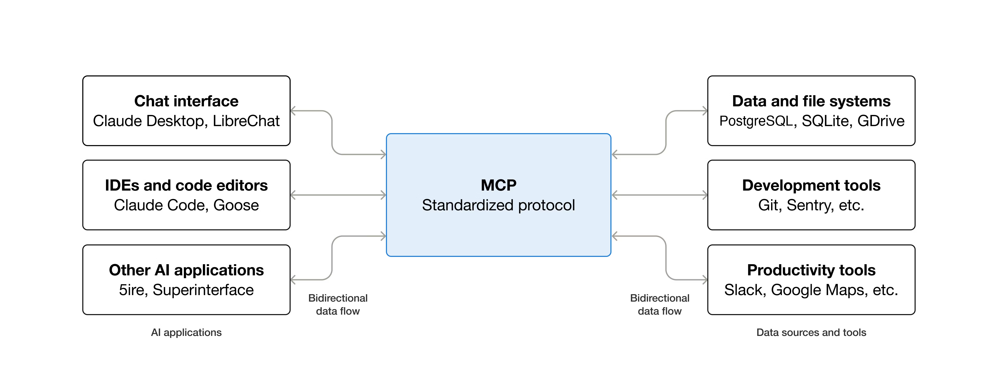
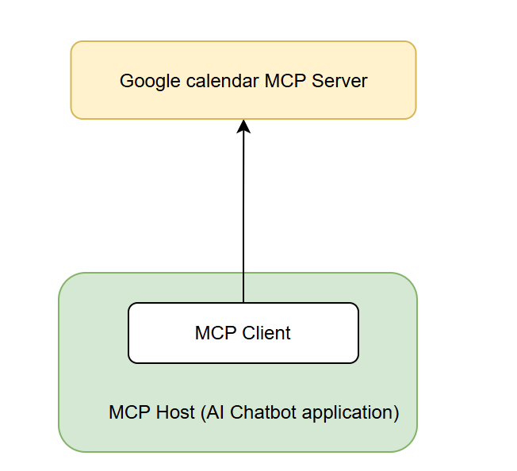
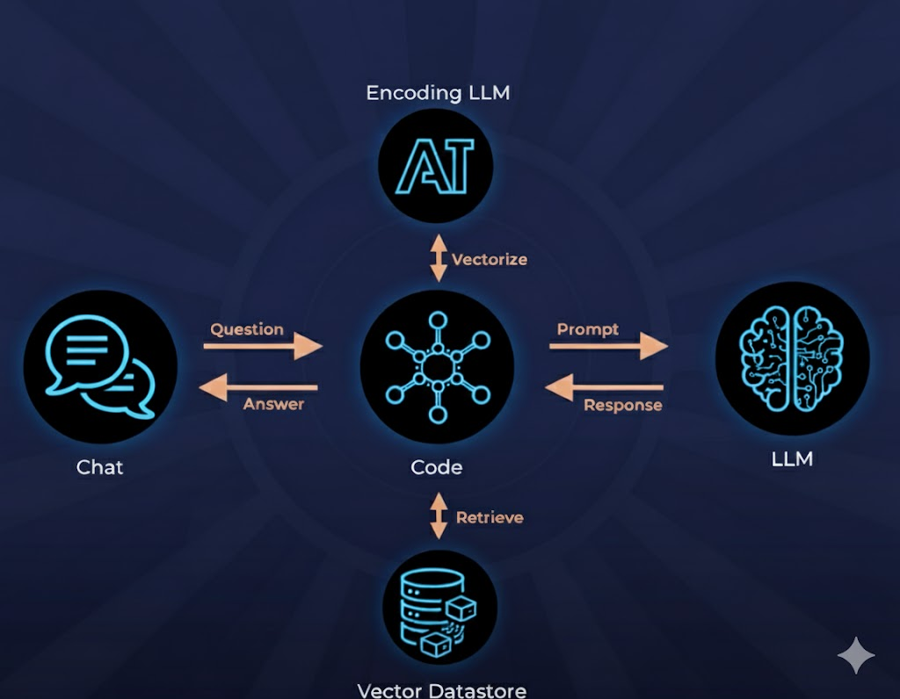

# Extend model capabilities 


## Table of contents

- [Overview](#overview)

- [Technologies used](#technologies-used)

- [Prerequisites](#prerequisites)

- [How to run](#how-to-run)

- [Methodologies extend model capabilities](#methodologies-extend-model-capabilities)

    - [Tool with function-calling](#tool-with-function-calling)
    - [Model context protocol (MCP)](#model-context-protocol-mcp)
    - [Retrieval-augmented generation (RAG)](#retrieval-augmented-generation-rag)


## Overview
- This document outlines various methodologies to extend the capabilities of AI models, including tool integration with function-calling, model context protocols, and retrieval-augmented generation techniques. 
- Repository provides a jupyter notebook that demonstrates these methodologies in action.

## Technologies used

- Programming Language: Python
- Libraries: OpenAI, LangChain, Gradio

## Prerequisites
- Python 3.10 or higher
- `uv` package for running the application
- OpenAI API key for accessing language models
- Gemini API key for image generation
- GCP oauth credentials for accessing Google calendar services
    - Please refer to [Google Calendar MCP Implementation](https://github.com/nspady/google-calendar-mcp) for setup instructions.
- Docker `28.1.1` used for running vector databases
- Vector database: `pgvector` 

## How to run
- Clone and navigate to the repository:
    ```bash
    git clone https://github.com/longtk26/ai-chatbot.git
    
    cd ai-chatbot
    ```

- Clone the open source repo for Google Calendar MCP Implementation:
    ```bash
    git clone https://github.com/nspady/google-calendar-mcp.git
    ```
- Navigate to the `google-calendar-mcp` directory and provide file `gcp-oauth.keys.json` with your GCP oauth credentials.
    ```bash
    cd google-calendar-mcp
    # Add your gcp-oauth.keys.json file here
    ```

- Install the required dependencies and build the project then return to the main project directory:
    ```bash
    npm install
    npm run build
    cd ..
    ```
- Create a `.env` file in the root directory and populate it with your API keys and database credentials. You can use the provided `.env.example` as a template:
    
- Start the PostgreSQL database with `pgvector` using Docker:
    ```bash
    docker compose up -d --build
    ```
- Init virtual environment with uv and install dependencies:
    ```bash
    uv venv 
    uv install -r requirements.txt
    source .venv/bin/activate
    ```
- Run `embedded.py` to import embeddings into the vector database:
    ```bash
    uv run src/embedded.py
    ```

- Run the Jupyter lab to explore the implementations:
    ```bash
    jupyter lab
    # Or using vscode jupyter extension
    ```

## Methodologies extend model capabilities

### Tool with function-calling

**What is tool with function-calling?**

When making a request to generate response, we can enable the function-calling feature of OpenAI models to allow the model to decide whether to call a function (tool) and which tool to call. This allows the model to interact with external systems or APIs to fetch real-time data or perform specific actions.

**Structure configuration with OpenAI**
```ts

tools = [
    {
        "type": "function",
        "name": "get_weather",
        "description": "Get current temperature for a given location.",
        "parameters": {
            "type": "object",
            "properties": {
                "location": {
                    "type": "string",
                    "description": "City and country e.g. Bogotá, Colombia",
                }
            },
            "required": ["location"],
            "additionalProperties": False,
        },
        "strict": True,
    },
]
```

**Example implementation**
- Please refer to the [notebook](src/chat-bot.ipynb) for detailed implementation.


### Model context protocol (MCP)
**What is MCP?**

> MCP (Model Context Protocol) is an open-source standard for connecting AI applications to external systems.

> Think of MCP like a USB-C port for AI applications. Just as USB-C provides a standardized way to connect electronic devices, MCP provides a standardized way to connect AI applications to external systems.

*Source: [Model Context Protocol](https://modelcontextprotocol.io/docs/getting-started/intro)*



**Architecture overview**

- Detail about MCP architecture can be found at the [official MCP documentation](https://modelcontextprotocol.io/docs/learn/architecture).
- Architecture is used in this implementation is as follows:


**Example implementation**
- Please refer to the [notebook](src/chat-bot.ipynb) for detailed implementation.

### Retrieval-augmented generation (RAG)
**What is RAG?**

> Retrieval-Augmented Generation (RAG) is an advanced AI framework that combines information retrieval with text generation models like GPT to produce more accurate and up-to-date responses. Instead of relying only on pre-trained data like traditional language models, RAG fetches relevant documents from an external knowledge source before generating an answer.

*Source: [What is Retrieval-Augmented Generation?](https://www.geeksforgeeks.org/nlp/what-is-retrieval-augmented-generation-rag/)*

**Architecture overview**


**Example implementation**
- Please refer to the [notebook](src/chat-bot.ipynb) for detailed implementation.